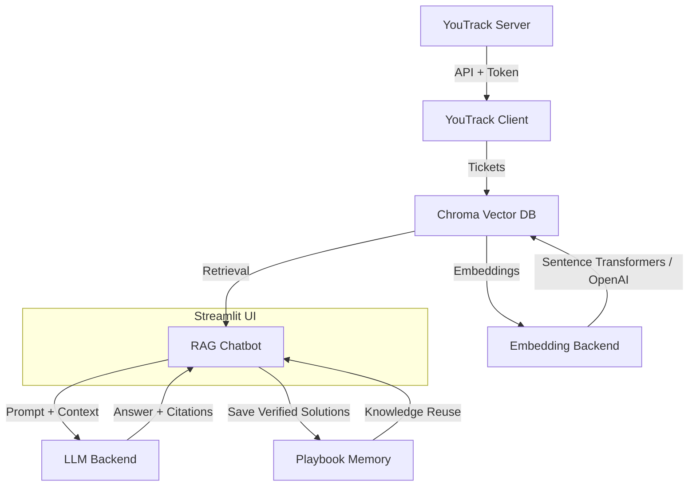

# From Ticket History to Intelligent Support: How We Automated YouTrack with RAG and LLMs

In large engineering or IT environments, ticket systems like **YouTrack** hold thousands of records — each representing experience, troubleshooting, and solutions.  
But searching through that history for similar past issues can be slow and inefficient.

That’s where the **YouTrack RAG Support App** comes in:  
a **retrieval-augmented generation (RAG)** assistant that turns your ticket database into an intelligent support engine, using **OpenAI** or **local LLMs via Ollama**.

---

## Why We Built It

Support engineers often face the same problem in different forms:
> “Has anyone solved this before?”

YouTrack already stores the answers — the challenge is retrieving and reusing them efficiently.  
Our goal was to **connect YouTrack**, **build a searchable knowledge base**, and **generate contextual answers** using Large Language Models (LLMs).

This app:
- Finds similar past tickets automatically  
- Summarizes potential solutions  
- Allows verified answers to be stored as reusable *playbooks*

✅ Faster response times  
✅ Consistent, documented solutions  
✅ Knowledge reuse across teams  

---

## Architecture Overview



---

## 1. YouTrack Connection

The app connects directly to your **YouTrack instance** through its REST API.  
After entering the **URL** and **Bearer Token** in the sidebar, projects and issues are automatically loaded.

```python
class YouTrackClient:
    def __init__(self, base_url: str, token: str):
        self.base_url = base_url.rstrip("/")
        self.token = token

    def list_projects(self):
        return self._get("/api/admin/projects", params={"fields": "name,shortName,id"})

    def list_issues(self, project_key: str, limit: int = 200):
        params = {"query": f"project: {project_key}", "$top": str(limit)}
        data = self._get("/api/issues", params=params)
        return [YTIssue(...data...)]
```

Once connected, the Streamlit interface displays a table of tickets with clickable IDs linking back to YouTrack.

---

## 2. Embeddings and Vector Database Configuration

Tickets are transformed into **vector embeddings** — numerical representations of their meaning — and stored in a **Chroma** vector database.

```python
class EmbeddingBackend:
    def __init__(self, use_openai: bool, model_name: str):
        if use_openai:
            self.client = OpenAI(api_key=get_openai_key())
        else:
            self.model = SentenceTransformer(model_name)

    def embed(self, texts: List[str]) -> List[List[float]]:
        if self.use_openai:
            res = self.client.embeddings.create(model=self.model_name, input=texts)
            return [d.embedding for d in res.data]
        return self.model.encode(texts, normalize_embeddings=True).tolist()
```

Each ticket becomes a document in Chroma:

```python
class VectorStore:
    def __init__(self, persist_dir: str, collection_name: str):
        self.client = chromadb.PersistentClient(path=persist_dir)
        self.col = self.client.get_or_create_collection(name=collection_name)

    def add(self, ids, documents, metadatas, embeddings):
        self.col.add(ids=ids, documents=documents,
                     metadatas=metadatas, embeddings=embeddings)
```

After indexing, the app displays the total number of stored tickets, ready for semantic search.

---

## 3. LLM Handling (OpenAI or Ollama)

When a user submits a new ticket description, the app retrieves similar tickets, builds a contextual prompt, and sends it to the selected **LLM backend**.

```python
class LLMBackend:
    def __init__(self, provider, model_name, temperature=0.2):
        if provider == "OpenAI":
            self.client = OpenAI(api_key=get_openai_key())
        elif provider == "Ollama (local)":
            self.ollama_host = "http://localhost:11434"
```

The generation logic is simple and robust:

```python
def generate(self, system: str, user: str) -> str:
    if self.provider == "OpenAI":
        res = self.client.responses.create(
            model=self.model_name,
            input=[{"role": "system", "content": system},
                   {"role": "user", "content": user}],
            temperature=self.temperature,
        )
        return res.output_text
    elif self.provider == "Ollama (local)":
        r = requests.post(f"{self.ollama_host}/api/chat", json={
            "model": self.model_name,
            "messages": [{"role": "system", "content": system},
                         {"role": "user", "content": user}],
        })
        return r.json().get("message", {}).get("content", "")
```

In both modes, the app always includes citations to the related ticket IDs:
> “Check the VPN configuration [NET-123], ensure certificate renewal [SEC-010].”

---

## 4. Saving Verified Answers as Playbooks

When an answer is correct and verified, users can save it as a **playbook** — a reusable summary of steps.  
Each playbook is stored as a document in a separate `memories` collection in Chroma, with metadata like project, creation date, and expiration (TTL).

```python
if st.button("✅ Mark as solved → Save as playbook"):
    meta = {
        "project": current_project,
        "created_at": now_ts(),
        "expires_at": ts_in_days(180),
        "tags": "playbook",
    }
    playbook_text = llm.generate(
        "You are an assistant who distills reusable mini-playbooks.",
        condense_prompt
    )
    _mem.add(ids=[mem_id],
             documents=[playbook_text],
             metadatas=[meta],
             embeddings=[mem_emb])
```

Playbooks can be listed, searched, and deleted directly from the interface — giving teams a **growing library of verified solutions**.

---

## 5. Example Workflow

1. Enter **YouTrack URL** and **Token**.  
2. Select a project → tickets are auto-loaded.  
3. Click **Index tickets** to create embeddings.  
4. Describe a new issue in the **RAG Chatbot**.  
5. The system finds related tickets and generates an AI-based response.  
6. Save verified answers as reusable playbooks.

---

## 6. Installation and Deployment

### Local Run
```bash
pip install -r requirements.txt
streamlit run app.py --server.port 8502
```

### Docker
```bash
docker build -t youtrack-rag .
docker run -d -p 8501:8501 -v ./data:/app/data youtrack-rag
```

### Docker Compose
```yaml
version: '3.9'
services:
  youtrack-rag:
    build: .
    container_name: youtrack_rag
    ports:
      - "8501:8501"
    environment:
      - OPENAI_API_KEY=${OPENAI_API_KEY}
    volumes:
      - ./data:/app/data
      - ./.streamlit:/app/.streamlit:ro
    restart: unless-stopped
```

### Cloud (Streamlit Cloud)
Push your repository to GitHub, connect it to **Streamlit Cloud**, and define your secrets in `secrets.toml`.  
The app automatically switches to *cloud mode* and adjusts file paths accordingly.

---

## 7. Security and Data Handling

- **API keys** and **tokens** are stored in memory only (not on disk).  
- All indexed data remains inside the local Chroma database.  
- With **Ollama**, no external API calls are made — everything stays local.  
- **Playbook memory** is optional, isolated, and can be purged anytime.

---

## 8. Future Directions

- Deduplication / *upsert* support for incremental indexing  
- Reranking and MMR to handle long or similar tickets  
- Integration with **Hugging Face models** via `vLLM` or `TGI`  
- A dashboard for ticket analytics and playbook usage metrics  
- Multi-user support with isolated preferences  

---

## Conclusion

The **YouTrack RAG Support App** transforms the way support teams interact with their history of tickets.  
It bridges traditional issue tracking with generative AI — turning *data* into *knowledge*.

> “Don’t just store your tickets — learn from them.”

Try it with your own YouTrack instance and see how **RAG + LLMs** can accelerate your troubleshooting process.
